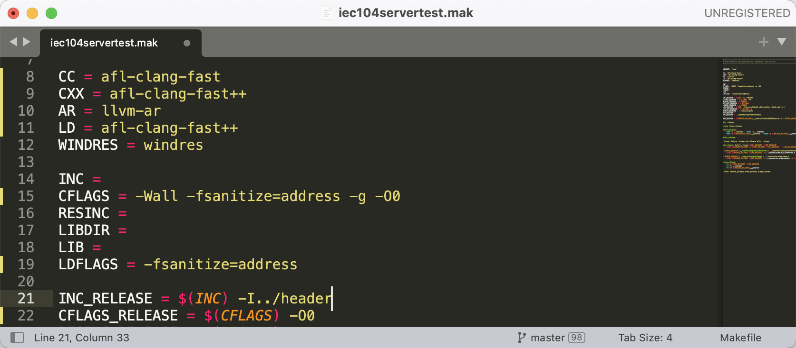
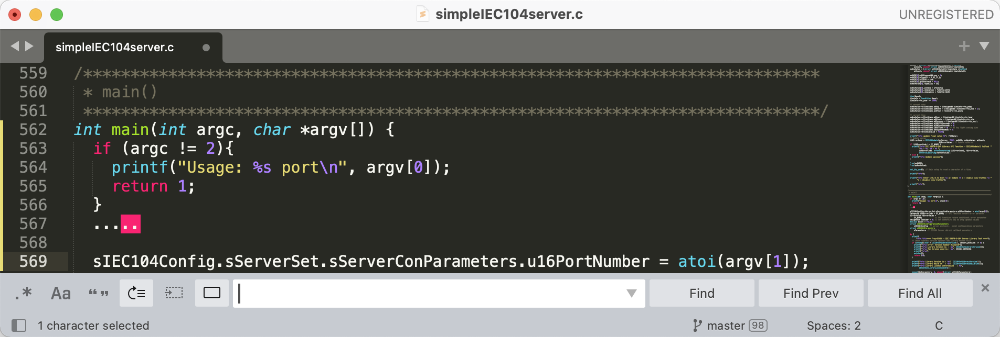
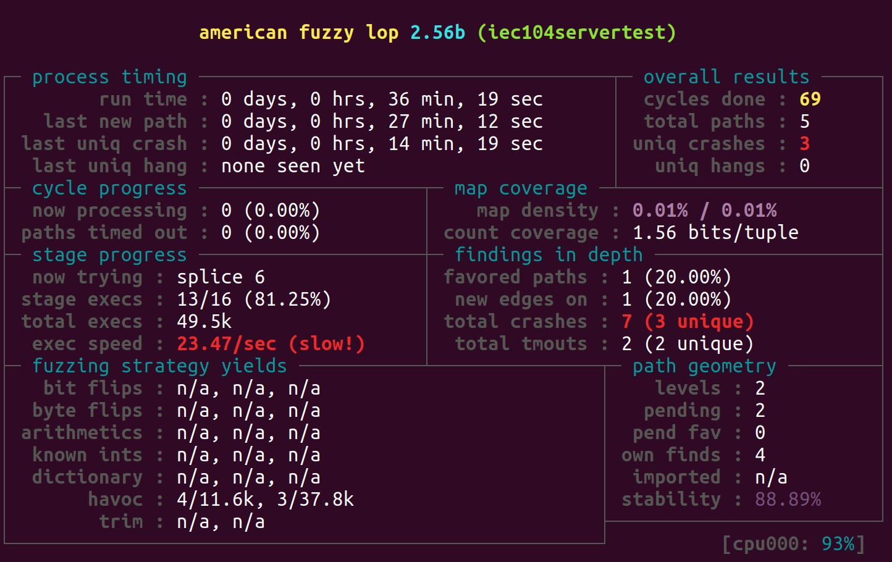

# Tutorial - Fuzzing FreyrSCADA/IEC-60870-5-104 server
This assumes that you have read the AFLNet README.md before reading this tutorial.

This tutorial was tested on Ubuntu 20.04.

## Step-0. Server compilation & setup
You can download the source code of IEC104 from the [FreyrSCADA/IEC-60870-5-104]([https://github.com/FreyrSCADA/IEC-60870-5-104.git]). To compile and set up the IEC104 for fuzzing, please use the following commands.

```bash
cd $WORKDIR
# Clone IEC104 repository
git clone https://github.com/FreyrSCADA/IEC-60870-5-104.git
# Move to the folder
cd IEC-60870-5-104/IEC\ 104\ Linux\ SDK/
unzip IEC104-LinuxSDK.zip
cd LinuxSDK/x86_64/
```
We make some modifications to ensure compatibility with the AFLNet. Specifically, we switched the C/C++ compiler to afl-clang-fast/afl-clang-fast++ and adjusted the implementation to pass the server port as a parameter. 


```bash
# Compile source
cd project
make -f iec104servertext.mak
```
Once source code has been successfully compiled, we can see an executable program ```iec104test``` in ```output```. 

## Step-1. Prepare message sequences as seed inputs

You can find a file to use as seed inputs in the ```aflnet/tutorials/iec104``` directory. If you want to create your own inputs, please follow the tutorial for fuzzing Live555 RTSP server included in the main AFLNet README.md. 

## Step-2. Fuzzing
```bash
cd $WORKDIR/libmodbus/tests
afl-fuzz -d -i $AFLNET/tutorials/iec104 -o out-iec104 -N tcp://127.0.0.1/2404 -P IEC104 -D 10000 -q 3 -s 3 -E -K -R -m none ./iec104servertest 2404
```
When you enter the fuzz command, you will see the following screenshot in the terminal. Once AFLNet discovers a bug, a crash or a hang, a test case containing the message sequence that triggers the bug will be stored in ```replayable-crashes``` or ```replayable-hangs``` folder. Then you can use the untility ```aflnet-replay``` to replay these message sequences. 

