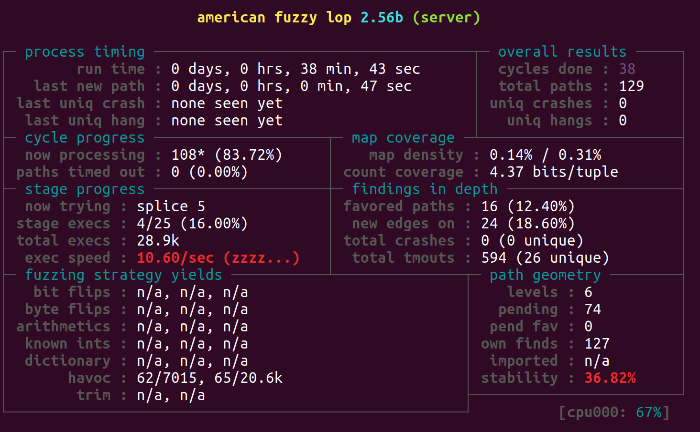

# Tutorial - Fuzzing libmodbus server
This assumes that you have read the AFLNet README.md before reading this tutorial.

This tutorial was tested on Ubuntu 20.04.

## Step-0. Server compilation & setup
You can download the source code of libmodbus from the [libmodbus](https://github.com/stephane/libmodbus). To compile and set up the libmodbus for fuzzing, please use the following commands.

```bash
cd $WORKDIR
# Clone libmodbus repository
git clone https://github.com/stephane/libmodbus.git
# Move to the folder
cd libmodbus
git checkout 5c14f13
# Apply a patch to change C/C++ compiler to afl-clang-fast/afl-clang-fast++
patch -p1 < $AFLNET/tutorials/libmodbus/fuzzing.patch
# Compile source
./autogen.sh
# use static library mode to generate the static library
./configure --enable-static
make clean all
```
We apply a patch to make the libmodbus server effectively fuzzable. In addition to the changes for genearting a Makefile which uses afl-clang-fast++ to do the coverage feedback-enabled instrumentation, we make a small change to the test program tests/random-test-server.c so that the port is a parameter. 

Once libmodbus source code has been successfully compiled, we can see the compiled library ```libmodbus.a``` in ```src/.libs```. We can also see some test examples are provided in the 'tests' directory, you can run these programs for a quick test of libmodbus. However, these compiled programs are shell scripts, not binary executables, so they cannot be used for fuzzing test. That's why we use static library mode to generate the static library. 

Then, we generate the program for fuzzing use the following commands.
```bash
cd tests
afl-clang-fast random-test-server.c -I../src ../src/.libs/libmodbus.a -o server
```

We should see the output ```server``` in the tests directory.

## Step-1. Prepare message sequences as seed inputs

You can find a file to use as seed inputs in the aflnet/tutorials/libmodbus/in-modbus directory. If you want to create your own inputs, please follow the tutorial for fuzzing Live555 RTSP server included in the main AFLNet README.md. You can use the program in tests to generate the requests.
```bash
cd tests
./random-test-server
# in another terminal
./random-test-client
```

## Step-2. Fuzzing
```bash
cd $WORKDIR/libmodbus/tests
afl-fuzz -d -i $AFLNET/tutorials/libmodbus/in-modbus -o out-libmodbus -N tcp://127.0.0.1/1502 -P MODBUS -D 10000 -q 3 -s 3 -E -K -R ./server 1502
```
When you enter the fuzz command, you will see the following screenshot in the terminal. Once AFLNet discovers a bug, a crash or a hang, a test case containing the message sequence that triggers the bug will be stored in ```replayable-crashes``` or ```replayable-hangs``` folder. Then you can use the untility ```aflnet-replay``` to replay these message sequences. 


## FAQs
1. PROGRAM ABORT: Pipe at the begining of 'core_pattern'
   ```bash
   sudo sh -c 'echo core > /proc/sys/kernel/core_pattern'
   ulimit -c unlimit
   ```
2. PROGRAM ABORT: Prrogram 'tcp://127.0.0.1/1502' not found or not executable.
   This is probably because the path of aflnet is not set correctly. Please check the calling path of aflnet and reset the PATH variables.
   ```bash
   which afl-fuzz
   echo $PATH
   ```


 
